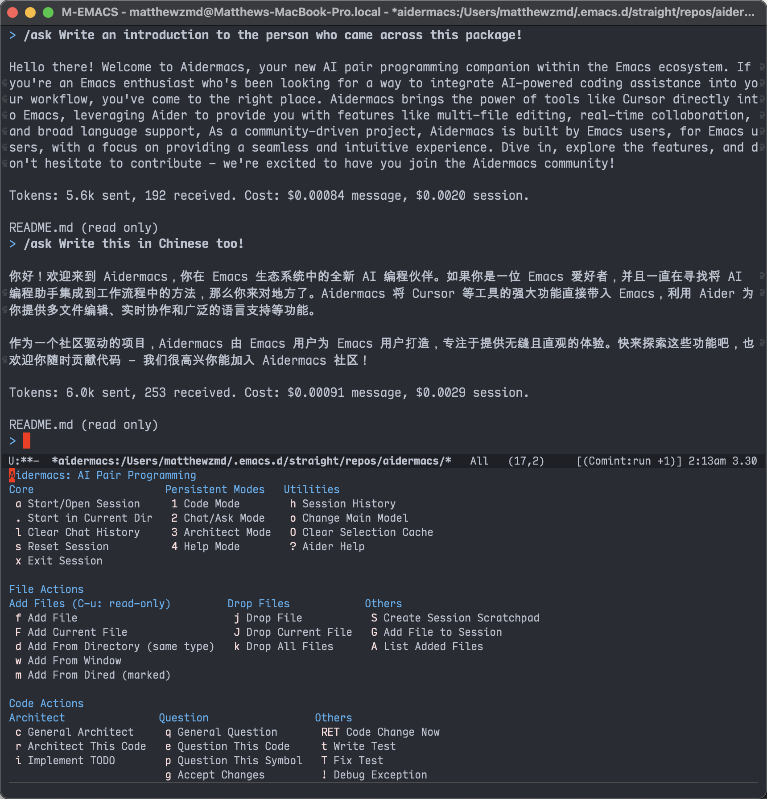

<p align="center">
  
</p>

# Aidermacs: AI Pair Programming in Emacs

Missing [Cursor](https://cursor.sh) but prefer living in Emacs? Aidermacs brings Cursor-like AI-powered development to your Emacs workflow by integrating [Aider](https://github.com/paul-gauthier/aider), one of the most powerful open-source AI pair programming tools. As a community-driven project, Aidermacs prioritizes Emacs users' needs and preferences while providing the same powerful features found in Cursor!

- Built-in **Ediff** integration for reviewing AI-generated changes
- Top performance on the SWE Bench, solving real GitHub issues in major open source projects
- Support for multi-file edits in complex codebases
- Real-time file synchronization for true pair programming
- Broad language support including Python, JavaScript, TypeScript, PHP, HTML, CSS, etc.
- Compatibility with leading AI models like Claude, ChatGPT, DeepSeek, etc.

## Why Aidermacs?

<p align="center">
  
</p>

### Video Demo!

[](https://www.youtube.com/watch?v=TPpyxaGZg1A)

### Community-Driven Development

Aidermacs thrives on community involvement. We believe collaborative development with user and contributor input creates the best software. We encourage you to:

- Contribute Code: Submit pull requests with bug fixes, new features, or improvements to existing functionality.
- Report Issues: Let us know about any bugs, unexpected behavior, or feature requests through GitHub Issues.
- Share Ideas: Participate in discussions and propose new ideas for making Aidermacs even better.
- Improve Documentation: Help us make the documentation clearer, more comprehensive, and easier to use.

Your contributions are essential for making Aidermacs the best AI pair programming tool in Emacs!

<a href = "https://github.com/MatthewZMD/aidermacs/graphs/contributors">
  
</a>

## Quick Start

1. Requirements
- Emacs ≥ 28.1
- [Aider](https://aider.chat/docs/install.html)
- [Transient](https://github.com/magit/transient)

2. Modify this **sample config** to your Emacs `init.el`:
```emacs-lisp
(use-package aidermacs
  :vc (:url "https://github.com/MatthewZMD/aidermacs" :rev :newest)
  :bind (("C-c p" . aidermacs-transient-menu))

  :config
  ; Enable minor mode for Aider files
  (aidermacs-setup-minor-mode)

  :custom
  ; See the Configuration section below
  (aidermacs-auto-commits t)
  (aidermacs-use-architect-mode t)
  (aidermacs-default-model "sonnet"))
```
3. Open a project and run `M-x aidermacs-transient-menu` or `C-c p` (where you bind it)
4. Add files and start coding with AI!

## Configuration

### Default Model Selection

You can customize the default AI model used by Aidermacs by setting the `aidermacs-default-model` variable:

```emacs-lisp
(setq aidermacs-default-model "sonnet")
```

This enables easy switching between different AI models without modifying the `aidermacs-extra-args` variable.

*Note: This configuration will be overwritten by the existence of an `.aider.conf.yml` file (see [details](#Overwrite-Configuration-with-Configuration-File)).*

### Dynamic Model Selection

Aidermacs offers intelligent model selection for solo (non-Architect) mode, automatically detecting and integrating with multiple AI providers:

- Automatically fetches available models from supported providers (OpenAI, Anthropic, DeepSeek, Google Gemini, OpenRouter)
- Caches model lists for quick access
- Supports both popular pre-configured models and dynamically discovered ones
- Handles API keys and authentication automatically
- Provides model compatibility checking

The dynamic model selection is only for the solo (non-Architect) mode.

To change models in solo mode:
1. Use `M-x aidermacs-change-model` or press `o` in the transient menu
2. Select from either:
   - Popular pre-configured models (fast)
   - Dynamically fetched models from all supported providers (comprehensive)

The system will automatically filter models to only show ones that are:
- Supported by your current Aider version
- Available through your configured API keys
- Compatible with your current workflow

### Architect Mode - Separating Code Reasoning and Editing Models

Aidermacs features an experimental mode using two specialized models for each coding task: an Architect model for reasoning and an Editor model for code generation. This approach has **achieved state-of-the-art (SOTA) results on aider's code editing benchmark**, as detailed in [this blog post](https://aider.chat/2024/09/26/architect.html).

To enable this mode, set `aidermacs-use-architect-mode` to `t`. You must also configure the `aidermacs-architect-model` variable to specify the model to use for the Architect role.

By default, the `aidermacs-editor-model` is the same as `aidermacs-default-model`. You only need to set `aidermacs-editor-model` if you want to use a different model for the Editor role.

When Architect mode is enabled, the `aidermacs-default-model` setting is ignored, and `aidermacs-architect-model` and `aidermacs-editor-model` are used instead.

```emacs-lisp
(setq aidermacs-use-architect-mode t)
(setq aidermacs-architect-model "o1-mini") ; default
(setq aidermacs-editor-model "deepseek/deepseek-chat") ;; defaults to aidermacs-default-model
```

*Note: This configuration will be overwritten by the existence of an `.aider.conf.yml` file (see [details](#Overwrite-Configuration-with-Configuration-File)).*

### Terminal Backend Selection

Choose your preferred terminal backend by setting `aidermacs-backend`:

`vterm` offers better terminal compatibility, while `comint` provides a simple, built-in option that remains fully compatible with Aidermacs.

```emacs-lisp
;; Use vterm backend (default is comint)
(setq aidermacs-backend 'vterm)
```

Available backends:
- `comint` (default): Uses Emacs' built-in terminal emulation
- `vterm`: Leverages vterm for better terminal compatibility


### Multiline Input Configuration

You can customize keybindings for multiline input, this key allows you to enter multiple lines without sending the command to Aider. Press `RET` normally to send the command.

```emacs-lisp
;; Comint backend:
(setq aidermacs-comint-multiline-newline-key "S-<return>")
;; Vterm backend:
(setq aidermacs-vterm-multiline-newline-key "S-<return>")
```

### Re-Enable Auto-Commits

Aider automatically commits AI-generated changes by default. We consider this behavior *very* intrusive, so we've disabled it. You can re-enable auto-commits by setting `aidermacs-auto-commits` to `t`:

```emacs-lisp
;; Enable auto-commits
(setq aidermacs-auto-commits t)
```

With auto-commits disabled, you must manually commit changes using your preferred Git workflow.

*Note: This configuration will be overwritten by the existence of an `.aider.conf.yml` file (see [details](#Overwrite-Configuration-with-Configuration-File)).*

### Customizing Aider Options with `aidermacs-extra-args`

If these configurations aren't sufficient, the `aidermacs-extra-args` variable enables passing any Aider-supported command-line options.

See the [Aider configuration documentation](https://aider.chat/docs/config/options.html) for a full list of available options.

```emacs-lisp
;; Set the verbosity:
(setq aidermacs-extra-args '("--verbose"))
```

These arguments will be appended to the Aider command when it is run. Note that the `--model` argument is automatically handled by `aidermacs-default-model` and should not be included in `aidermacs-extra-args`.


### Overwrite Configuration with Configuration File

Aidermacs supports project-specific configurations via `.aider.conf.yml` files. To enable this:

1.  Create a `.aider.conf.yml` in your home dir, project's root, or the current directory, defining your desired settings. See the [Aider documentation](https://aider.chat/docs/config/aider_conf.html) for available options.

2.  Tell Aidermacs to use the config file in one of two ways:

    ```emacs-lisp
    ;; Set the `aidermacs-config-file` variable in your Emacs config:
    (setq aidermacs-config-file "/path/to/your/project/.aider.conf.yml")
    ;; *Or*, include the `--config` or `-c` flag in `aidermacs-extra-args`:
    (setq aidermacs-extra-args '("--config" "/path/to/your/project/.aider.conf.yml"))
    ```

*Note: You can also rely on Aider's default behavior of automatically searching for `.aider.conf.yml` in the home directory, project root, or current directory, in that order. In this case, you do not need to set `aidermacs-config-file` or include `--config` in `aidermacs-extra-args`.*

* **Important:** When using a config file, all other Aidermacs configuration variables supplying an argument option (e.g., `aidermacs-default-model`, `aidermacs-architect-model`, `aidermacs-use-architect-mode`) are **IGNORED**. Aider will *only* use the settings specified in your `.aider.conf.yml` file. Do not attempt to combine these Emacs settings with a config file, as the results will be unpredictable.
* **Precedence:** Settings in `.aider.conf.yml` *always* take precedence when a config file is explicitly specified.
* **Avoid Conflicts:** When using a config file, *do not* include model-related arguments (like `--model`, `--architect`, etc.) in `aidermacs-extra-args`.  Configure *all* settings within your `.aider.conf.yml` file.

### Claude 3.7 Sonnet Thinking Tokens

Aider can work with Sonnet 3.7's [new thinking tokens](https://www.anthropic.com/news/claude-3-7-sonnet), but does not ask Sonnet to use thinking tokens by default.

Enabling thinking currently requires manual configuration. Create an `.aider.model.settings.yml` in  your home dir, project's root, or the current directory, then add the following to the file. Adjust the `budget_tokens` value to change the target number of thinking tokens.

```yaml
- name: anthropic/claude-3-7-sonnet-20250219
  edit_format: diff
  weak_model_name: anthropic/claude-3-5-haiku-20241022
  use_repo_map: true
  examples_as_sys_msg: true
  use_temperature: false
  extra_params:
    extra_headers:
      anthropic-beta: prompt-caching-2024-07-31,pdfs-2024-09-25,output-128k-2025-02-19
    max_tokens: 64000
    thinking:
      type: enabled
      budget_tokens: 32000 # Adjust this number
  cache_control: true
  editor_model_name: anthropic/claude-3-7-sonnet-20250219
  editor_edit_format: editor-diff
```

More streamlined support will be coming soon.

## Usage

### Getting Started

The main interface to Aidermacs is through its transient menu system (similar to Magit). Access it with:

```
M-x aidermacs-transient-menu
```

Or bind it to a key in your config:

```emacs-lisp
(global-set-key (kbd "C-c a") 'aidermacs-transient-menu)
```

Once the transient menu is open, you can navigate and execute commands using the displayed keys. Here's a summary of the main menu structure:

##### Core
- `a`: Start/Open Session (auto-detects project root)
- `.`: Start in Current Directory (good for monorepos)
- `l`: Clear Chat History
- `s`: Reset Session
- `x`: Exit Session

##### Persistent Modes
- `1`: Code Mode
- `2`: Chat/Ask Mode
- `3`: Architect Mode
- `4`: Help Mode

##### Utilities
- `^`: Show Last Commit (if auto-commits enabled)
- `u`: Undo Last Commit (if auto-commits enabled)
- `h`: Session History
- `o`: Change Main Model
- `O`: Clear Selection Cache
- `?`: Aider Help

##### File Actions
- `f`: Add File (C-u: read-only)
- `F`: Add Current File
- `d`: Add From Directory (same type)
- `w`: Add From Window
- `m`: Add From Dired (marked)
- `j`: Drop File
- `J`: Drop Current File
- `k`: Drop All Files
- `A`: List Added Files
- `S`: Create Session Scratchpad
- `G`: Add File to Session

##### Code Actions
- `c`: General Architect
- `r`: Architect This Code
- `i`: Implement TODO
- `q`: General Question
- `e`: Question This Code
- `p`: Question This Symbol
- `g`: Accept Changes
- `RET`: Code Change Now
- `t`: Write Test
- `T`: Fix Test
- `!`: Debug Exception

The `All File Actions` and `All Code Actions` entries open submenus with more specialized commands. Use the displayed keys to navigate these submenus.

### Prompt Files Minor Mode

Aidermacs provides a minor mode that makes it easy to work with prompt files and other Aider-related files. The minor mode can be enabled automatically for specific files by calling `(aidermacs-setup-minor-mode)` in your config:

```emacs-lisp
(aidermacs-setup-minor-mode)
```

When enabled, the minor mode provides these convenient keybindings:

- `C-c C-n` or `C-<return>`: Send line/region line-by-line
- `C-c C-c`: Send block/region as whole
- `C-c C-z`: Switch to Aidermacs buffer

The minor mode is automatically enabled for:
- `.aider.prompt.org` files (create with `M-x aidermacs-open-prompt-file`)
- `.aider.chat.md` files
- `.aider.chat.history.md` files
- `.aider.input.history` files

#### Working with Prompt Files

The `.aider.prompt.org` file is particularly useful for:
- Storing frequently used prompts
- Documenting common workflows
- Quick access to complex instructions

You can customize which files automatically enable the minor mode by configuring `aidermacs-auto-mode-files`:

```emacs-lisp
(setq aidermacs-auto-mode-files
      '(".aider.prompt.org"
        ".aider.chat.md"
        ".aider.chat.history.md"
        ".aider.input.history"
        "my-custom-aider-file.org"))  ; Add your own files
```

## Aidermacs vs aider.el

Aidermacs is designed to provide a more Emacs-native experience while still integrating with [Aider](https://github.com/paul-gauthier/aider). It began as a fork of [aider.el](https://github.com/tninja/aider.el), but has since diverged significantly to prioritize Emacs workflow integration.

While `aider.el` strictly mirrors Aider's CLI behavior, `Aidermacs` is built around Emacs-specific features and paradigms. This design philosophy allows you to harness Aider's powerful capabilities through a natural, Emacs-native coding experience.

With `Aidermacs`, you get:

1. Built-in Ediff Integration for AI-Generated Changes
   - Seamless Code Review: Automatically shows diffs for all AI-modified files using Emacs' powerful `ediff` interface
   - Familiar Interface: Uses Emacs' native `ediff` workflow for reviewing changes
   - Interactive Workflow: Accept or reject changes with standard `ediff` commands
   - Syntax Highlighting: Maintains proper syntax highlighting during comparisons
   - Safe Change Management: Preserves original file states for easy comparison and rollback

2. Intelligent Model Selection
   - Automatic discovery of available models from multiple providers
   - Real-time model compatibility checking
   - Seamless integration with your configured API keys
   - Caching for quick access to frequently used models
   - Support for both popular pre-configured models and dynamically discovered ones

3. Flexible Terminal Backend Support
   - `Aidermacs` supports multiple terminal backends (comint and vterm) for better compatibility and performance
   - Easy configuration to choose your preferred terminal emulation
   - Extensible architecture for adding new backends

4. Smarter Syntax Highlighting
   - AI-generated code appears with proper syntax highlighting in major languages.
   - Ensures clarity and readability without additional configuration.

5. Better Support for Multiline Input
   - `aider` is primarily designed as a command-line program, where multiline input is restricted by terminal limitations.
   - Terminal-based tools require special syntax or manual formatting to handle multiline input, which can be cumbersome and unintuitive.
   - `Aidermacs` eliminates these restrictions by handling multiline prompts natively within Emacs, allowing you to compose complex AI requests just like any other text input.
   - Whether you're pasting blocks of code or refining AI-generated responses, multiline interactions in `Aidermacs` feel natural and seamless.

6. Enhanced File Management from Emacs
   - List files currently in chat with `M-x aidermacs-list-added-files`
   - Drop specific files from chat with `M-x aidermacs-drop-file`
   - View output history with `M-x aidermacs-show-output-history`
   - Interactively select files to add with `M-x aidermacs-add-files-interactively`
   - Add content from any file to a specific session with `M-x aidermacs-add-file-to-session`
   - Create a temporary file for adding code snippets or notes to the Aider session with `M-x aidermacs-create-session-scratchpad`
   - and more

7. Greater Configurability
   - `Aidermacs` offers more customization options to tailor the experience to your preferences.

8. Streamlined Transient Menu Selection
   - The transient menus have been completely redesigned to encompass functionality and ergonomics, prioritizing user experience.

9. Flexible Ways to Add Content
   - `Aidermacs` provides multiple ways to add content to the Aider session, including adding files, creating temporary scratchpad files, and more.

10. Community-Driven Development
    - `Aidermacs` is actively developed and maintained by the community, incorporating user feedback and contributions.
    - We prioritize features and improvements that directly benefit Emacs users, ensuring a tool that evolves with your needs.

... and more to come 🚀

## Troubleshooting

### Aider not found
- Ensure Aider is installed: `pip install aider-chat`
- Check `aidermacs-program` points to correct path

### No response from AI
- Verify API keys are set correctly
- Check model selection matches your API access
- Try simpler prompts first

### Ediff not working
- Ensure `ediff` is installed
- Check file permissions
- Try restarting Emacs

## Example Workflows

### Implementing a Feature
1. Add relevant files with `f` or `F`
2. Switch to Architect mode with `3`
3. Describe the feature: "/architect Implement user login system"
4. Review changes with Ediff
5. Accept/reject changes

### Debugging Code
1. Add file with error
2. Place cursor on error
3. Run `!` (Debug Exception)
4. Follow AI's debugging steps

### Writing Tests
1. Add file to test
2. Run `t` (Write Test)
3. Review generated tests
4. Run tests to verify

## FAQ

### How is this different from Copilot?
Aidermacs uses Aider which is more focused on code modification and architecture rather than just completion.

### Can I use my own AI models?
Yes! Aidermacs supports any OpenAI-compatible API endpoint.

### Is my code sent to the AI provider?
Yes, the code you add to the session is sent to the AI provider. Be mindful of sensitive code.
